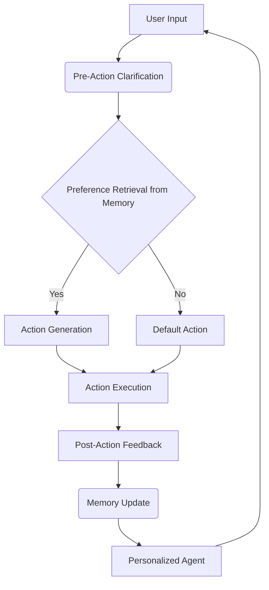

# 📄 Paper Digest: 2026-02-19

## Learning Personalized Agents from Human Feedback

| 項目 | 詳細 |
|------|------|
| **著者** | Kaiqu Liang, Julia Kruk, Shengyi Qian, Xianjun Yang, Shengjie Bi 他7名 |
| **発表日** | 2026-02-19T00:00:00-05:00 |
| **分野** | AI |
| **arXiv** | [リンク](https://arxiv.org/abs/2602.16173) |
| **PDF** | [リンク](https://arxiv.org/pdf/2602.16173) |

---

### 🎓 前提知識

*   **強化学習 (Reinforcement Learning):** エージェントが環境とのインタラクションを通じて、報酬を最大化するように学習する手法。ゲームのAIプレイヤーが、試行錯誤を通じて最適な戦略を見つけ出すのに似ています。例えば、スーパーマリオが何度もプレイするうちに、どのジャンプが成功しやすいか、どこに敵が潜んでいるかを学習していくようなものです。
*   **埋め込み (Embedding):** 単語やアイテムなどの情報を、数値ベクトルで表現する技術。これにより、AIは言葉の意味やアイテムの関連性を理解しやすくなります。例えば、映画のジャンルや出演者、あらすじなどを数値化して、似た映画を推薦するレコメンドエンジンで使われています。これは、図書館で本の情報を整理するために、本のジャンルやキーワードをタグ付けするようなものです。
*   **メモリネットワーク (Memory Network):** 外部メモリを利用して、過去の情報を保持・利用するニューラルネットワーク。これにより、AIは長期的な文脈を理解し、より複雑なタスクをこなせるようになります。これは、AIが日記帳を持ち、過去の出来事を参照しながら行動を決定するようなものです。

### 📖 この研究が解こうとしている問題

現在のAIエージェントは高性能だが、**ユーザーごとの細かな好みや、時間とともに変化する好みに対応するのが苦手**だ。例えば、あなたが長年使っている音楽ストリーミングサービスがあったとしよう。最初はおすすめされる曲に満足していたが、最近好みが変わってきたのに、以前のおすすめばかりが表示される…なんて経験はないだろうか？従来のAIは、過去のデータに基づいて学習するため、新しいユーザーや変化する好みに柔軟に対応できない。既存の手法では、ユーザーの過去の行動履歴から暗黙的な好みを学習したり、ユーザープロファイルを外部メモリに保存したりするが、これらは新しいユーザーや、時間とともに変化する好みに対応するのが難しいのだ。つまり、**AIエージェントを、まるで長年の友人のように、あなたの好みを理解し、変化に合わせてくれる存在にするには、どうすればいいのか？** この論文は、まさにこの課題に挑戦している。

### 🔬 手法・アプローチ

この論文の手法を一言でいえば、**「ユーザーとの対話と明示的なフィードバックを通じて、個人の好みを学習し、変化に対応するAIエージェントを作る」アプローチ**だ。

提案手法であるPAHF (Personalized Agents from Human Feedback) は、ユーザーとのインタラクションを通じて、エージェントが個人の好みを継続的に学習するフレームワークだ。具体的には、エージェントは行動を起こす前に、ユーザーに曖昧な点を明確にするための質問（pre-action clarification）を行い、メモリから取得した好みに基づいて行動（grounding actions）する。そして、行動後にユーザーから明示的なフィードバックを受け取り、メモリを更新（integrating post-action feedback）することで、好みの変化に対応する。

この手法の核心は、**明示的なフィードバックとメモリの活用**にある。ユーザーからの直接的なフィードバックを積極的に取り入れることで、AIはより迅速かつ正確に個人の好みを学習できる。また、メモリに過去のインタラクションの情報を保存することで、長期的な文脈を考慮した行動が可能になる。

ただし、このアプローチにもトレードオフはある。ユーザーに質問をしたり、フィードバックを求める手間がかかるため、**ユーザーエクスペリエンスを損なう可能性**がある。また、メモリのサイズが大きくなると、**計算コストが増加する**可能性もある。しかし、初期のパーソナライズエラーを減らし、好みの変化への迅速な適応を可能にすることで、これらのコストに見合うだけの価値がある、と論文では主張している。

### 🏗️ アーキテクチャ図

この図は、PAHFフレームワークの主要なステップを示しています。ユーザーの入力に基づいて、エージェントはまず事前の明確化を行い、メモリから好みを検索します。その結果に応じて行動を生成し、実行後にはユーザーからのフィードバックを基にメモリを更新します。

### 💡 主要な貢献

*   **明示的な記憶を用いた継続的なパーソナライズを実現** — 従来の静的なデータセットに依存するアプローチとは異なり、PAHFはユーザーとのオンラインインタラクションを通じて、個人の好みを継続的に学習します。
*   **曖昧さの解消と行動の根拠付けを分離** — 事前に行動の明確化を求めることで、エージェントはユーザーの意図をより正確に理解し、好みに基づいた行動を生成できます。
*   **デュアルフィードバックチャネルの有効性** — 行動前後のフィードバックを組み合わせることで、エージェントは初期のパーソナライズエラーを減らし、好みの変化に迅速に適応できます。
*   **実証的な評価プロトコルの開発** — 体現操作とオンラインショッピングという2つのドメインで、エージェントのパーソナライズ能力を定量的に評価するための4段階のプロトコルを開発しました。

### 🌍 実務への応用可能性

この研究の成果は、顧客対応を必要とする様々なソフトウェアやシステムに活用できます。例えば、ECサイトの商品レコメンデーション、バーチャルアシスタントの応答、ゲームのAIキャラクターの行動などが挙げられます。既存のレコメンデーションエンジンやチャットボットにPAHFの仕組みを組み込むことで、よりパーソナライズされた体験を提供できます。開発者は、ユーザーとのインタラクションを通じて得られる明示的なフィードバックを効果的に活用するための仕組みを設計し、その情報を保存・更新するためのメモリ構造を構築することから始めることができます。フレームワークとしては、強化学習ライブラリ（TensorFlow Agents, RLlib）や、ベクトルデータベース（Pinecone, Weaviate）を組み合わせることで、PAHFのようなシステムを比較的容易に構築可能です。

### 📚 関連キーワード

*   **Personalized Recommendation** — ユーザーの個々の好みに合わせてアイテムを推薦する技術。PAHFは、この技術をさらに進化させ、動的な好み変化に対応できるようにします。
*   **Reinforcement Learning from Human Feedback (RLHF)** — 人間のフィードバックを報酬信号として利用し、強化学習エージェントを訓練する手法。PAHFは、RLHFをさらに発展させ、明示的なメモリを活用することで、より効率的な学習を実現します。
*   **Vector Database** — 高次元ベクトルデータを効率的に格納・検索するためのデータベース。PAHFにおけるユーザーの好みやコンテキスト情報をベクトルとして表現し、類似度の高い情報を高速に検索するために利用できます。
*   **Continual Learning** — 新しいデータが継続的に入力される環境において、モデルが過去の知識を忘れることなく学習し続ける能力。PAHFは、明示的な記憶機構により、好みの変化に柔軟に対応し、継続的な学習を実現します。
*   **User Interface (UI) Personalization** — ユーザーの好みに合わせてUIのレイアウトやデザインを最適化する技術。PAHFの技術を応用することで、ユーザーの行動やフィードバックに基づいて、UIを動的に変化させることができます。
*   **Large Language Models (LLMs)** — 大量のテキストデータで学習された大規模な言語モデル。PAHFのエージェントは、LLMを利用して自然な対話を行い、ユーザーの意図を理解し、適切な行動を生成することができます。
*   **Human-Computer Interaction (HCI)** — 人間とコンピュータ間の相互作用を研究する分野。PAHFは、HCIの原則に基づき、ユーザーフレンドリーなインタラクションを通じて、より効果的なパーソナライズを実現します。

---
Auto-generated by Paper Digest workflow. Category: AI