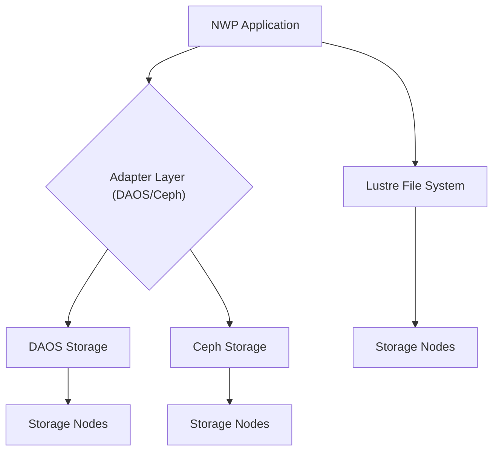

# 📄 Paper Digest: 2026-02-21

## Exploring Novel Data Storage Approaches for Large-Scale Numerical Weather Prediction

| 項目 | 詳細 |
|------|------|
| **著者** | Nicolau Manubens Gil |
| **発表日** | 2026-02-19T18:35:41Z |
| **分野** | 大規模分散処理 |
| **arXiv** | [リンク](https://arxiv.org/abs/2602.17610v1) |
| **PDF** | [リンク](https://arxiv.org/pdf/2602.17610v1) |

---

### 🎓 前提知識

*   **POSIXファイルシステム:** みなさんが普段使っているファイルシステム（ext4, XFSなど）の標準規格のこと。ファイルの読み書きを、ディレクトリ構造を通じて行うのが特徴だ。**現実世界で例えるなら、図書館の蔵書管理システムのようなもの。** 本（ファイル）は書架（ディレクトリ）に整理され、目録（inode）を引けばどこにあるかすぐにわかる。
*   **オブジェクトストレージ:** ファイルを「オブジェクト」という単位で管理するストレージシステム。POSIXとは異なり、ディレクトリ構造を持たない。各オブジェクトには一意なIDが割り振られ、それを元にアクセスする。**これは、Amazon S3のようなクラウドストレージを想像してもらうと近い。** オブジェクト（データ）はバケットと呼ばれる場所に格納され、URLで直接アクセスできる。
*   **数値天気予報 (NWP):** 現在の気象状況を元に、未来の天気を予測するシミュレーションのこと。スーパーコンピュータを使って膨大な計算を行う必要がある。**言わば、巨大な実験室で地球のミニチュア版を動かし、その変化を観察するようなもの。** 計算には大量の過去データやリアルタイムデータが必要で、その読み書きがボトルネックになることも多い。

### 📖 この研究が解こうとしている問題

大規模な数値天気予報(NWP)は、ますます巨大化するデータと、それを高速に処理する要求に直面している。現在のNWPシステムでは、POSIXファイルシステムとNVMe SSDを組み合わせた構成が一般的だが、これには限界がある。特に、大量のデータを並列で読み書きする際に、POSIXファイルシステムのメタデータ処理がボトルネックになることが多いんだ。例えるなら、高速道路で車（データ）はたくさん走れるのに、料金所（メタデータ処理）が混んでいて渋滞が発生するようなものだ。この問題に対処するため、よりスケーラブルで高性能なストレージソリューションが求められている。特に、ECMWF（欧州中期気象予報センター）のような機関では、日々の天気予報の精度向上と計算時間短縮のために、ストレージシステムの改善が不可欠な課題となっているんだ。従来のPOSIXベースのストレージでは、将来的なデータ量の増加に対応しきれない可能性があるため、新しいアプローチの検討が急務だ。

### 🔬 手法・アプローチ

一言でいえば、**数値天気予報のI/Oボトルネックを、オブジェクトストレージ（DAOSとCeph）で解決するアプローチである。**

この研究では、ECMWFのNWPシステムで、従来のLustreファイルシステムに加えて、DAOSとCephという2つのオブジェクトストレージシステムを導入し、その性能を比較検証している。まず、NWPシステムがこれらのストレージを利用できるように、ソフトウェアレベルのアダプタを開発したんだ。これにより、既存のコードを大きく変更することなく、新しいストレージシステムを試せるようになった。そして、様々なI/O負荷パターンでベンチマークテストを実施し、Lustreと比較してDAOSとCephがどのような性能を発揮するかを評価した。その結果、DAOSとCephはどちらも優れた性能を示したが、特にDAOSはLustreを上回るスケーラビリティと柔軟性を示したんだ。これは、大量のデータを並列に処理するNWPのようなアプリケーションにとって大きなメリットになる。

ただし、オブジェクトストレージへの移行にはトレードオフも存在する。POSIXファイルシステムに依存した既存のコードを修正する必要がある場合があるし、オブジェクトストレージ特有の管理や運用ノウハウも必要になる。しかし、この研究は、適切なアダプタとチューニングによって、オブジェクトストレージがHPC分野で十分に競争力のある選択肢になることを示唆している。

### 🏗️ アーキテクチャ図

この図は、NWPアプリケーションが、アダプタ層を介してDAOSまたはCephストレージ、あるいは直接Lustreファイルシステムにアクセスする様子を示しています。DAOS, Ceph, Lustreはそれぞれ異なるストレージノード群にデータを格納します。

### 💡 主要な貢献

*   **DAOSが大規模I/Oにおいて優れた性能を示す** — Lustreと比較して、DAOSはより高いスケーラビリティと柔軟性を提供し、NWPのような大規模データ処理アプリケーションに適していることが示された。
*   **オブジェクトストレージへの移行パスを提示** — 既存のNWPシステムに対するソフトウェアアダプタの開発を通じて、POSIX I/Oからオブジェクトストレージへの段階的な移行が可能であることを実証した。
*   **HPCにおけるオブジェクトストレージの可能性を強調** — DAOSとCephの性能評価を通じて、オブジェクトストレージがHPC環境において、従来のPOSIXファイルシステムに代わる実行可能な選択肢であることを示した。
*   **ストレージ技術選定の判断材料を提供** — NWPアプリケーションのI/O特性に基づいて、DAOS、Ceph、Lustreの性能を比較分析し、特定のワークロードに最適なストレージ技術を選択するための洞察を提供した。

### 🌍 実務への応用可能性

この研究の成果は、大規模データ処理を伴う様々な分野で応用できます。例えば、ゲノム解析、金融モデリング、ビッグデータ分析など、HPC環境を利用するアプリケーションにおけるストレージ最適化に役立ちます。既存のアプリケーションにオブジェクトストレージを導入する際には、本研究で開発されたアダプタ層の考え方を参考に、既存コードへの影響を最小限に抑えつつ、新しいストレージシステムを活用できます。読者が自分のプロジェクトに取り入れるとしたら、まずは小規模なデータセットでオブジェクトストレージの性能を評価し、I/Oボトルネックの特定と改善効果の検証から始めるのが良いでしょう。また、DAOSやCephの導入だけでなく、MinIOのようなより軽量なオブジェクトストレージソリューションを検討することも有効です。

### 📚 関連キーワード

*   **DAOS (Distributed Asynchronous Object Storage)** — Intelが開発した、高性能な分散オブジェクトストレージシステム。
*   **Ceph** — スケーラビリティと信頼性に優れた、オープンソースの分散ストレージシステム。
*   **Lustre** — HPC環境で広く利用されている、高性能な並列ファイルシステム。
*   **NVMe SSD** — 高速なデータアクセスを提供する、不揮発性メモリを用いたストレージデバイス。
*   **POSIX** — オペレーティングシステムの標準規格であり、ファイルシステムAPIの標準化も含む。
*   **ECMWF (European Centre for Medium-Range Weather Forecasts)** — ヨーロッパ中期気象予報センター。
*   **Object Storage** — ファイルをオブジェクトとして扱うストレージアーキテクチャ。S3互換のAPIを持つものが多い。
*   **MinIO** — 軽量で扱いやすい、S3互換のオブジェクトストレージサーバ。開発環境やエッジコンピューティング環境での利用に適している。

---
Auto-generated by Paper Digest workflow. Category: 大規模分散処理